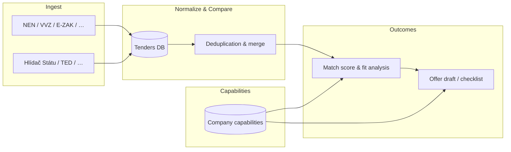

# Application Goals

This document defines what the crawler application is for and what success looks like. It should guide implementation priorities — especially before and during the crawling work.

## Primary Goal

Enable the company to **match its capabilities and products against relevant government contracts**, and to **quickly prepare a precise, well-grounded offer** based on what the company can actually deliver.

The app is not just a tender aggregator. It is a **decision and preparation tool**: find the right opportunities, understand how well they fit, and assemble an offer with confidence.

---

## The Problem

Public procurement in Czechia is fragmented across many platforms (NEN, VVZ, E-ZAK, Tender Arena, Hlídač Státu, TED, and others — see [tender-sources.md](./tender-sources.md)). Each source exposes different fields, update cadences, and levels of detail.

At the same time, a useful offer depends on knowing **what we can deliver**: services, technologies, certifications, past projects, team capacity, product features, and pricing constraints. That knowledge lives in documents, spreadsheets, and people's heads — not in the tender portals.

Without a system that connects **our capabilities** to **normalized tender data**, matching opportunities and drafting offers stays slow, manual, and error-prone.

---

## Core Capabilities (Three Pillars)

### 1. Track "My" Capabilities

Maintain a structured, searchable model of what the company and its products can offer.

**Includes (non-exhaustive):**

- **Services** — e.g. custom software development, integration, support, consulting
- **Technologies & stacks** — languages, frameworks, cloud platforms, databases
- **Products** — named offerings with features, licensing models, deployment options
- **Certifications & compliance** — ISO, security clearances, sector-specific requirements
- **Reference projects** — past public-sector work, domains, contract sizes
- **Constraints** — team capacity, geographic coverage, minimum/maximum project size

**Why it matters:** Matching and offer preparation both start from a single source of truth about what we can credibly promise.

**Open design questions:**

- How granular should capabilities be (tags vs. hierarchical taxonomy vs. free text)?
- Who maintains them (manual entry, import from internal docs, periodic review)?
- How do products relate to services (one capability model or separate entities)?

---

### 2. Get All Relevant Information from Crawled Sources

Ingest tender data from the configured sources, normalize it into a common schema, and keep it fresh enough to act on.

**Includes:**

- Crawling / polling / API integration per source (see [tender-sources.md](./tender-sources.md))
- Normalized storage of tenders (see [database.md](./database.md) — `tenders` table)
- Extraction of fields needed for matching and offers: title, description, CPV codes, deadline, contracting authority, estimated value, status, links to full documentation
- Retention of **raw source payloads** for audit and re-parsing
- Filtering relevance (e.g. IT CPV codes, keywords) so the pipeline focuses on actionable opportunities

**Why it matters:** Offers must be grounded in accurate, complete tender requirements — not summaries from a single portal.

**Open design questions:**

- Which sources to integrate first (Hlídač Státu API and TED are low-complexity starting points)?
- How deep to go on first pass (list metadata only vs. fetching tender documents/attachments)?
- Refresh intervals and alerting when new matching tenders appear?

---

### 3. Compare Sources Against Each Other

The same tender (or the same procedure) often appears on multiple platforms with slightly different metadata, timing, or completeness.

**Includes:**

- **Cross-source deduplication** — recognize when records refer to the same underlying procedure
- **Field-level comparison** — highlight where sources disagree (deadline, value, status, description)
- **Completeness ranking** — prefer the richest or most authoritative record per tender
- **Provenance** — always know which source contributed which field and when it was last seen

**Why it matters:** Relying on a single source risks missed deadlines, wrong values, or incomplete requirements. Comparison builds trust in the data before committing to an offer.

**Open design questions:**

- Matching keys: external notice IDs, title + authority + date fuzzy match, EU notice numbers?
- Merge strategy: latest-wins, authoritative-source-wins, or manual review queue for conflicts?
- UI for surfacing conflicts vs. silent automatic merge?

---

## How the Pillars Connect

1. **Crawl** → normalized tenders in the database
2. **Compare** → one canonical view per opportunity, with source lineage
3. **Match** → score or rank tenders against stored capabilities
4. **Prepare offer** → structured output (requirements checklist, capability mapping, gaps to address)

---

## Success Criteria

| Area         | We know it's working when…                                                                                     |
| ------------ | -------------------------------------------------------------------------------------------------------------- |
| Capabilities | We can describe what we offer in one place and update it without touching code                                 |
| Ingestion    | New relevant IT tenders appear in the app within the configured refresh window                                 |
| Comparison   | Duplicate listings collapse into one record; conflicts are visible or resolved consistently                    |
| Matching     | We can filter or rank tenders by fit against our capabilities, not just by keyword                             |
| Offer prep   | For a chosen tender, we can quickly see which requirements we cover, which we don't, and what evidence to cite |

---

## Out of Scope (For Now)

These may come later but are not prerequisites for the first useful version:

- Automated submission to procurement portals
- Full document parsing (PDF/DOCX tender specifications) — may start with links + manual review
- Pricing optimization or win-probability modeling
- Multi-tenant / multiple companies in one deployment

---

## Suggested Implementation Order

1. **Tender ingestion** — one or two high-value sources, normalized schema (in progress)
2. **Cross-source identity & comparison** — dedup and merge rules before adding many sources
3. **Capabilities model** — schema + UI to define and maintain company/product profile
4. **Matching** — rules or scoring linking capabilities to tender fields (CPV, keywords, requirements)
5. **Offer preparation** — views and exports that map tender requirements to capability evidence

This order ensures we have data to match against before building the matching layer, and capabilities defined before automating offer drafts.

---

## Related Documentation

- [tender-sources.md](./tender-sources.md) — Czech public tender platforms and integration strategies
- [database.md](./database.md) — D1 schema and setup
